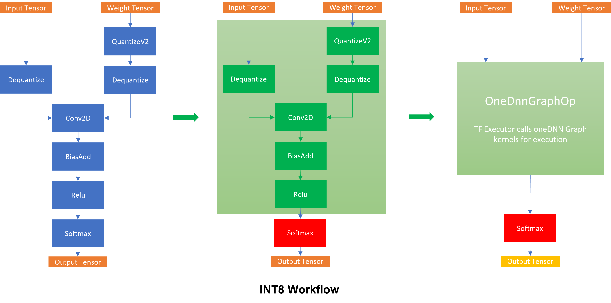

# INT8 Quantization

## Overview
Quantization is a very popular deep learning model optimization technique invented for improving the speed of inference. It minimizes the number of bits required by converting a set of real-valued numbers into the lower bit data representation, such as INT8, mainly on inference phase with minimal to no loss in accuracy. This way reduces the memory requirement, cache miss rate, and computational cost of using neural networks and finally achieve the goal of higher inference performance.

Intel® Extension for TensorFlow\* co-works with Intel® Neural Compressor(https://github.com/intel/neural-compressor) v2.0 or newer to provide two INT8 quantization solutions on GPU and CPU, respectively. 

On GPU, Intel® Extension for Tensorflow \* uses legacy compatible TensorFlow INT8 quantization solution. Please find a step by step practice [accelerating AlexNet quantization example](../../examples/accelerate_alexnet_by_quantization/README.md). And the following description of new INT8 quantization on CPU can be skipped. 

On CPU, Intel® Extension for Tensorflow \* integrates and adopts new [oneDNN Graph API](https://spec.oneapi.io/onednn-graph/latest/introduction.html) in INT8 quantization for better out of box performance. 

## Workflow 

The green subgraph is one of the supported oneDNN Graph INT8 pattern. The operators within the subgraph are converted into a single `OneDnnGraph` operator, which calls oneDNN Graph kernel during execution.

The workflow mainly contains 2 parts: graph optimization and graph executor.
* Graph optimization: TensorFlow graph is partitioned into subgraphs based on compatibility of oneDNN Graph.
* Kernel Execution: The compatible subgraphs are executed by oneDNN Graph, and the result of operators in the graph are delegated to native kernels.


## Usage
oneDNN Graph optimization pass is enabled on INT8 quantization by default on CPU. 

In order to get better performance in INT8 models execution, TF grappler constant folding optimization is required to be disabled by the following environment variable setting.

```
export ITEX_TF_CONSTANT_FOLDING=0
```

Please refer to [Inception V3 quantization example](../../examples/quantize_inception_v3/README.md) for details.
