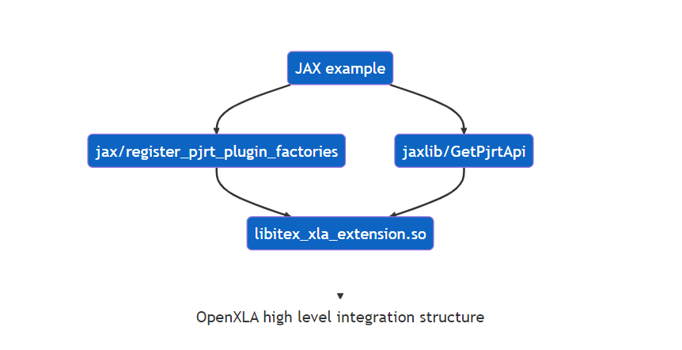

# OpenXLA Support on GPU
This guide introduces the overview of OpenXLA high level integration structure, and demonstrates how to build Intel® Extension for TensorFlow* and run JAX example with OpenXLA.

## 1. Overview
Intel® Extension for TensorFlow* adopts PJRT plugin interface to implement Intel GPU backend for OpenXLA experimental support, and takes JAX front end APIs as example. PJRT is a uniform device API in OpenXLA ecosystem. Refer to [OpenXLA PJRT Plugin RFC](https://github.com/openxla/community/blob/main/rfcs/20230123-pjrt-plugin.md) for more details.

 

* [JAX](https://jax.readthedocs.io/en/latest/) provides a familiar NumPy-style API, includes composable function transformations for compilation, batching, automatic differentiation, and parallelization, and  the same code executes on multiple backends.
* In JAX python package, [`jax/_src/lib/xla_bridge.py`](https://github.com/google/jax/blob/jaxlib-v0.4.4/jax/_src/lib/xla_bridge.py#L317-L320)
    ```c++
    register_pjrt_plugin_factories(os.getenv('PJRT_NAMES_AND_LIBRARY_PATHS', ''))
    ```
    `register_pjrt_plugin_factories` registers backend for PJRT plugins. For intel XPU  `PJRT_NAMES_AND_LIBRARY_PATHS` is set to be `'xpu:Your_itex_path/bazel-bin/itex/libitex_xla_extension.so'`,  `xpu` is the backend name and `libitex_xla_extension.so` is the PJRT plugin library.
* In jaxlib python package `jaxlib/xla_extension.so`,    
   Jaxlib gets the lastest tensorflow code which calls the [PJRT C API interface](https://github.com/tensorflow/tensorflow/blob/master/tensorflow/compiler/xla/pjrt/c/pjrt_c_api.h). The backend needs to implement these API.
*  `libitex_xla_extension.so` implements `PJRT C API interface` which can be got in [GetPjrtApi](https://github.com/tensorflow/tensorflow/blob/master/tensorflow/compiler/xla/pjrt/pjrt_api.cc#L82).

## 2. Build Library for JAX
There are some differences from   [source build procedure](https://github.com/intel/intel-extension-for-tensorflow/blob/main/docs/install/how_to_build.md)
* Make sure get Intel® Extension for TensorFlow* main branch code and python version >=3.8.
* In TensorFlow installation steps, make sure to install jax and jaxlib at the same time.
   ```bash
    $ pip install tensorflow==2.12.0 jax==0.4.4 jaxlib==0.4.4
   ```
* In "Configure the build" step, run ./configure, select yes for JAX support,

    >=> "Do you wish to build for JAX support? [y/N]: Y"
* Build command:
    ```bash
    $ bazel build --config=jax -c opt //itex:libitex_xla_extension.so
    ```
Then we can get the library with xla extension   **./bazel-bin/itex/libitex_xla_extension.so**

## 3. Run JAX Example
* **Set library path.**
```bash
$ export PJRT_NAMES_AND_LIBRARY_PATHS='xpu:Your_itex_path/bazel-bin/itex/libitex_xla_extension.so'
$ export LD_LIBRARY_PATH=$LD_LIBRARY_PATH:Your_Python_site-packages/jaxlib # Some functions defined in xla_extension.so are needed by libitex_xla_extension.so

$ export ITEX_VERBOSE=1 # Optional variable setting. It shows detailed optimization/compilation/execution info.
```
* **Run the below jax python code.**
```python
import jax
import jax.numpy as jnp

@jax.jit
def lax_conv():
  key = jax.random.PRNGKey(0)
  lhs = jax.random.uniform(key, (2,1,9,9), jnp.float32)
  rhs = jax.random.uniform(key, (1,1,4,4), jnp.float32)
  side = jax.random.uniform(key, (1,1,1,1), jnp.float32)
  out = jax.lax.conv_with_general_padding(lhs, rhs, (1,1), ((0,0),(0,0)), (1,1), (1,1))
  out = jax.nn.relu(out)
  out = jnp.multiply(out, side)
  return out

print(lax_conv())
```
* **Reference result:**
```
I itex/core/devices/gpu/itex_gpu_runtime.cc:129] Selected platform: Intel(R) Level-Zero
I itex/core/compiler/xla/service/service.cc:176] XLA service 0x56060b5ae740 initialized for platform sycl (this does not guarantee that XLA will be used). Devices:
I itex/core/compiler/xla/service/service.cc:184]   StreamExecutor device (0): <undefined>, <undefined>
I itex/core/compiler/xla/service/service.cc:184]   StreamExecutor device (1): <undefined>, <undefined>
[[[[2.0449753 2.093208  2.1844783 1.9769732 1.5857391 1.6942389]
   [1.9218378 2.2862523 2.1549542 1.8367321 1.3978379 1.3860377]
   [1.9456574 2.062028  2.0365305 1.901286  1.5255247 1.1421617]
   [2.0621    2.2933435 2.1257985 2.1095486 1.5584903 1.1229166]
   [1.7746235 2.2446113 1.7870374 1.8216239 1.557919  0.9832508]
   [2.0887792 2.5433128 1.9749291 2.2580051 1.6096935 1.264905 ]]]


 [[[2.175818  2.0094342 2.005763  1.6559253 1.3896458 1.4036925]
   [2.1342552 1.8239582 1.6091168 1.434404  1.671778  1.7397764]
   [1.930626  1.659667  1.6508744 1.3305787 1.4061482 2.0829628]
   [2.130649  1.6637266 1.594426  1.2636002 1.7168686 1.8598001]
   [1.9009514 1.7938274 1.4870623 1.6193901 1.5297288 2.0247464]
   [2.0905268 1.7598859 1.9362347 1.9513799 1.9403584 2.1483061]]]]
```
If `ITEX_VERBOSE=1` is set, the log looks like this:
```
I itex/core/compiler/xla/service/hlo_pass_pipeline.cc:301] Running HLO pass pipeline on module jit_lax_conv: optimization
I itex/core/compiler/xla/service/hlo_pass_pipeline.cc:181]   HLO pass fusion
I itex/core/compiler/xla/service/hlo_pass_pipeline.cc:181]   HLO pass fusion_merger
I itex/core/compiler/xla/service/hlo_pass_pipeline.cc:181]   HLO pass multi_output_fusion
I itex/core/compiler/xla/service/hlo_pass_pipeline.cc:181]   HLO pass gpu-conv-rewriter
I itex/core/compiler/xla/service/hlo_pass_pipeline.cc:181]   HLO pass onednn-fused-convolution-rewriter

I itex/core/compiler/xla/service/gpu/gpu_compiler.cc:1221] Build kernel via LLVM kernel compilation.
I itex/core/compiler/xla/service/gpu/spir_compiler.cc:255] CompileTargetBinary - CompileToSpir time: 11 us (cumulative: 99.2 ms, max: 74.9 ms, #called: 8)

I itex/core/compiler/xla/pjrt/pjrt_stream_executor_client.cc:2201] Executing computation jit_lax_conv; num_replicas=1 num_partitions=1 num_addressable_devices=1
I itex/core/compiler/xla/pjrt/pjrt_stream_executor_client.cc:2268] Replicated execution complete.
I itex/core/compiler/xla/pjrt/pjrt_stream_executor_client.cc:1208] PjRtStreamExecutorBuffer::Delete
I itex/core/compiler/xla/pjrt/pjrt_stream_executor_client.cc:1299] PjRtStreamExecutorBuffer::ToLiteral
```

**4. More JAX examples.**    
Get examples from [https://github.com/google/jax](https://github.com/google/jax/tree/jaxlib-v0.4.4/examples) to run.
```bash
$ git clone https://github.com/google/jax.git
$ cd jax && git checkout jax-v0.4.4
$ export PJRT_NAMES_AND_LIBRARY_PATHS='xpu:Your_itex_path/bazel-bin/itex/libitex_xla_extension.so'
$ python -m examples.mnist_classifier
```
